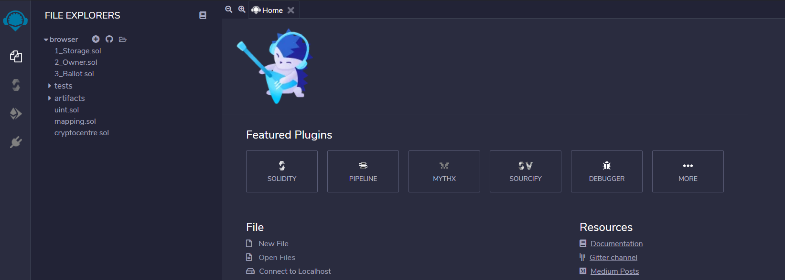
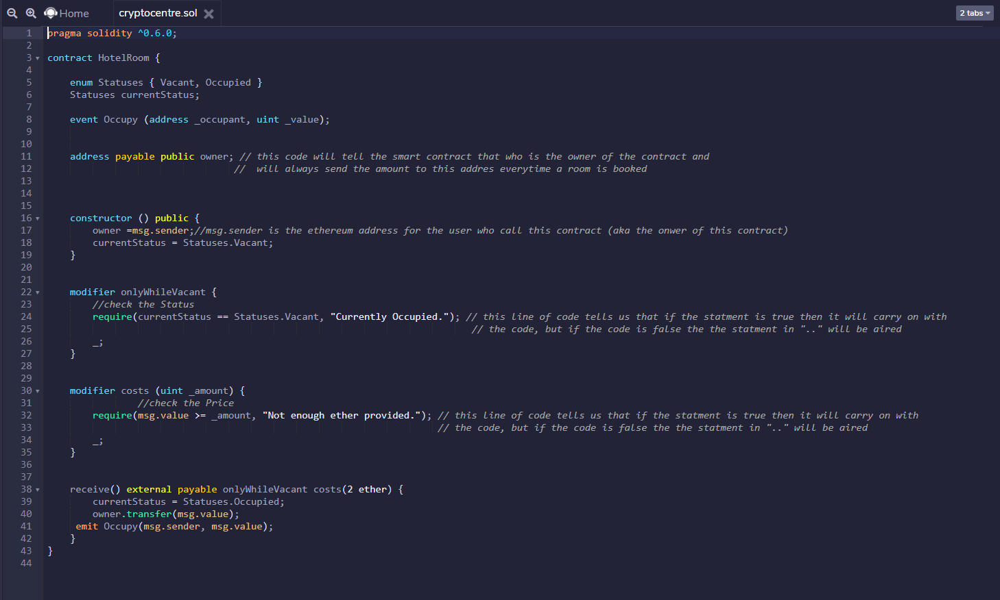
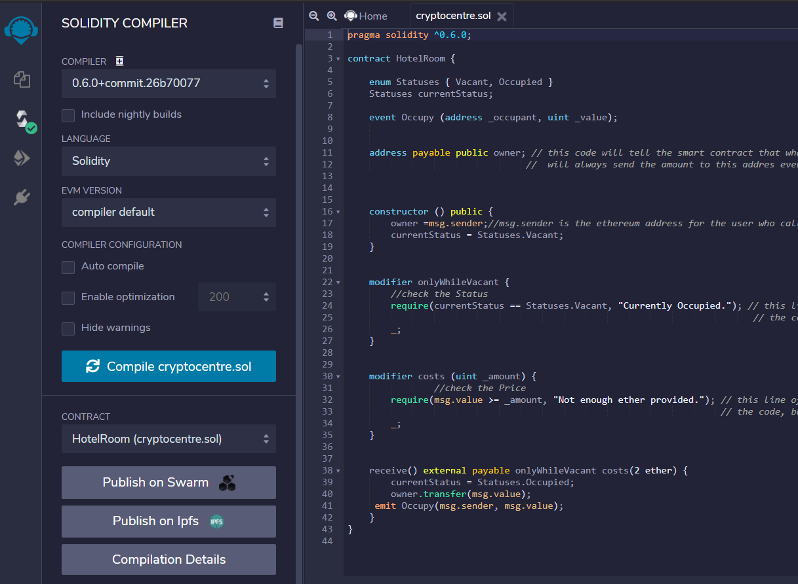
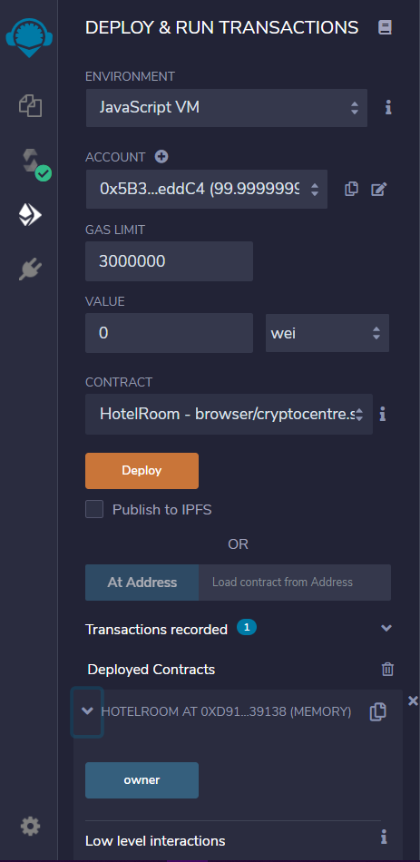
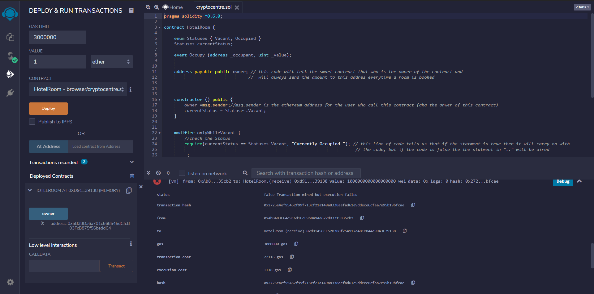
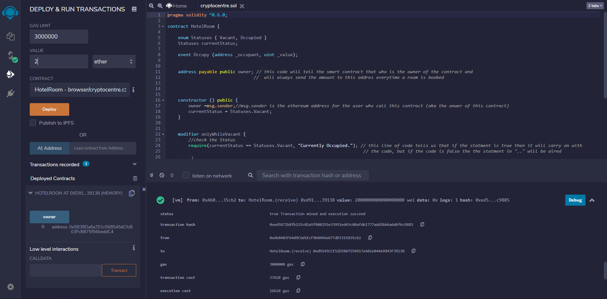
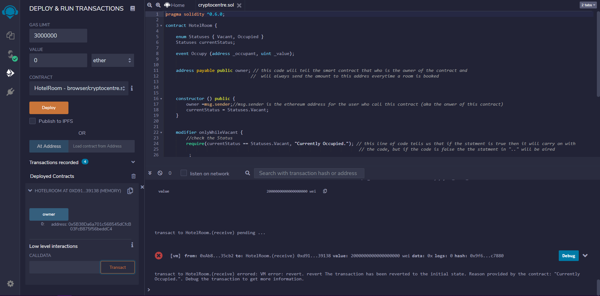

# Hotel Room 🏠
## This is a Solidity program that helps us to book Hotel room

## How to use this code  ?  🤔

TO USE THIS CODE TO FULL EFFECT YOU HAVE TO GO THROUGH THIS README FILE.

## Here are the *Steps*  🤘🏻
## Step 1  ⭐
Copy and paste this code  in "https://remix.ethereum.org/"

## Step 2  ⭐
Copy the exact code in REMIX.

## Step 3  ⭐
Go and compile the code with the compilers versoin of ^0.6.0 or better !

## Step 4  ⭐
Then deploy the current contract !

## Step 5  ⭐
Initally click at owner that will give you your address, then change the **Account** and then set it to **1 ether** and then click at the **Transact buttopn**
##*The result will showed failed because of not enoght amount given*

## Step 6  ⭐
Change the **Amount** to 2 ether and then press **Transact button** again.
##*The result will show succesfull because of enough amount given*

## Step 7  ⭐
There is another case:-
As you have succesfully booked the Hotel room now if you again want to book the same room, then the *transaction failed*

This was just a in-browser Demo !! A backend smart contract, work is still left to do here 

